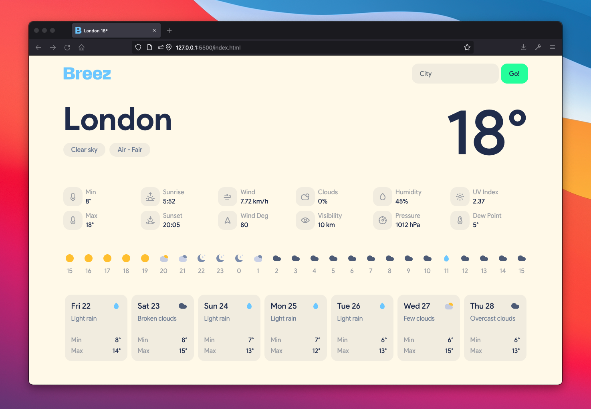
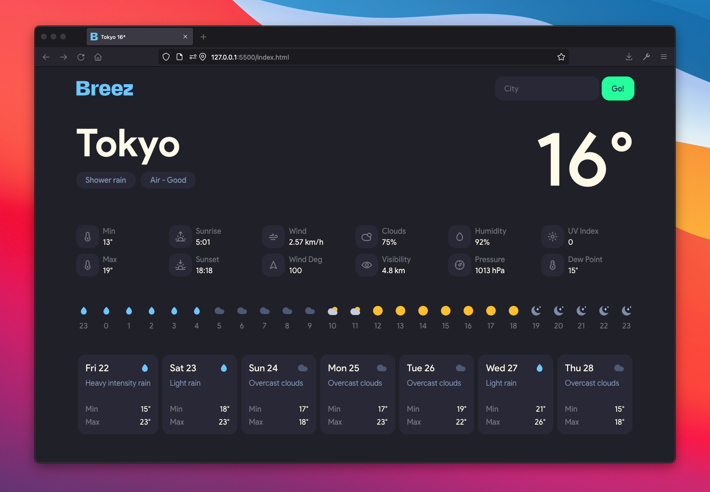

  

A web-based weather app

## About

Breez is a weather app for the web made with plain HTML, CSS and Javascript

## Data

Breez uses data from the [OpenWeather API](https://openweathermap.org/api).

## Features

-   **Geolocation** - Get geographical position of the user.
-   **Search City** - Search over 200,000 cities.
-   **Air Quality Index** - Current air pollution data.
-   **Current Weather** - Current weather including:
    Min, Max, Sunrise, Sunset, Wind, Wind Degree, Clouds, Visibility, Humidity, Pressure, UV Index, Dew Point.
-   **Hourly Forecast** - Display weather forecast for the next 24 hrs.
-   **Daily Forecast** - Display weather forecast for the following 7 days.
